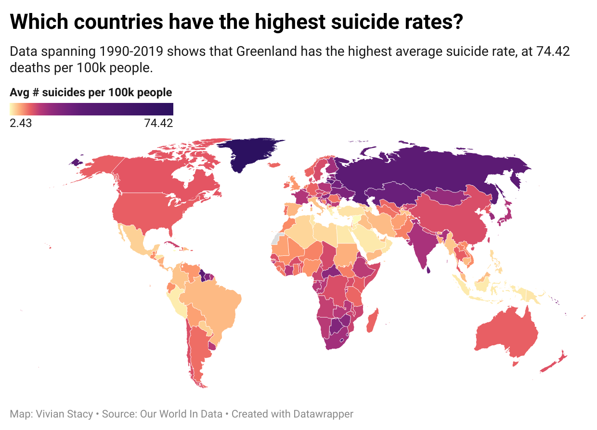

# J124 - Introduction to Data Journalism: Final Project
## Suicide statistics by country: Greenland's Silent Epidemic
By Vivian Stacy

### **Data Analysis** 
#### **Steps**
1. Download the following datasets from ['Our World in Data'](https://ourworldindata.org/suicide#share-of-deaths-from-suicide) as csv files:
- [Share of deaths from suicide](https://ourworldindata.org/grapher/share-deaths-suicide?tab=chart)
- [Death rates from suicide](https://ourworldindata.org/grapher/suicide-death-rates?tab=chart&country=~GRL)
- [Male vs female suicide rate](https://ourworldindata.org/grapher/male-vs-female-suicide)
2. Import the csv files into one Google Sheets file, creating three separate sheets.
3. Bold and freeze the header row of each sheet.
4. Create a pivot table from the ‘Death rates from suicide’ dataset to answer question 1. Place ‘country’ under rows, and ‘Deaths’ under values, making sure to select ‘summarize by average’. Then, change the order of the ‘country’ column to descending, and sort by Average of ‘Deaths’. The resulting pivot table will give you the answers to question 1, which countries have the highest/lowest suicide rates.
5. Create a new pivot table to determine which year had the highest suicide rates. Place ‘year’ under rows, and ‘deaths’ under values, making sure to select ‘summarize by average’. Then sort by the average of ‘deaths’ in descending order. 
6. To learn if suicide rates have been increasing or decreasing, change the existing pivot table to sort by ‘year’. Then, eyeball the column and look for patterns in whether or not the numbers are increasing or decreasing as you go up and down the list. By doing this, the answer to question 3 quickly becomes obvious.
7. Next, create a new pivot table, this time using the data range from ‘Male vs female suicide’. Place ‘country’ under rows, and ‘male suicide rate’ and ‘female suicide rate’ under values, making sure to select ‘summarize by average’ for both. By toggling the ‘sort by’ function between sorting the columns in descending order of both male and female suicide rates, and then comparing each list side by side, one can see the major differences between the two lists and draw conclusions based on these patterns.
8. Now, compare your pivot table from question 1 to a new pivot table that measures suicide as a share of total global deaths, putting ‘country’ in rows and ‘deaths’ in values and keeping all the same settings as the question 1 pivot table. Compare the two tables to each other, noticing the drastic differences between the two lists, which helps answer question 5. 

#### **Questions** 
1. What countries have the highest average suicide rates? What countries have the lowest?

    The countries with the highest average suicide rates are Greenland (74.42 deaths per 100k), Lithuania (35.99 deaths per 100k), and Lesotho (35.71 deaths per 100k). The countries with the lowest suicide rates are Jamaica (2.43), Syria (2.49), and Sao Tome and Principe (2.51). 

2. What year had the highest global suicide rates? 

    1995 had the highest global suicide rate, peaking at 13.48 deaths per 100k people.
    
3.  Have global suicide rates been increasing or decreasing?

    Global suicide rates slowly increased at first, but have been decreasing since they peaked in 1995. 

4. What countries have the highest male suicide rates? What countries have the highest female suicide rates? Are there any major differences?

    Greenland has the highest suicide rates for both male and female, but the following three are all completely different. Russia, Lithuania, and Eastern Europe have the next highest male suicide rates, while Lesotho, India, and Zimbabwe have the next highest female suicide rates. The following pivot tables show the countries sorted first by male suicide rates, then by female, and the lists are made up of completely different countries/regions. 

5. Which countries have higher suicide rates than shares of death, or vice versa?

    There are notable differences in data between the two forms of measuring suicide. Lithuania, with the second highest suicide rate in the world at 35.99 deaths per 100k, ranks 19 when measuring suicide as a share of total deaths for countries across the world. Lesotho, with the third highest suicide rate in the world ranks 23. 

### **Story pitch** 
While Greenland is a beautiful country with a uniquely thriving culture that attracts hundreds of thousands to millions of tourists each year, it also happens to have the highest suicide rate in the world, and has for the past twenty years. A possible contributing factor to this trend is the clash between traditional Inuit culture and ‘modernization’, a term scholars use to describe the encroachment of modern industrialism, secularism, and urban society into older, more traditional rural or agrarian cultures. Greenland was a Danish colony until the 1950’s, and now is a district of Denmark, but the majority of Greenland’s population remain the indigenous, or Inuit. The Inuit have traditionally accepted suicide more than other cultures, especially among the old, sick, or poor, or among those whose problems seem too complex to solve. It is theorized that these traditional ideas combined with the psychological stress modernization places on Inuit youth, whose cultural values of autonomy and individual aggression clash with capitalistic modern society, have lead to a significant rate of suicide. I would like to explore all these ideas in a feature piece that pulls together statistics from a variety of sources to draw a conclusion on why suicide remains so common in the region, and if people are doing anything to try and mitigate it.

***Source 1:*** *Kirsten Thisted, Associate Professor at the University of Copenhagen - Professor of Greenlandic and Arctic Studies in the Department of Cross-Cultural and Regional Studies*
- Her focus is on minority/majority relations, postcolonial relations, and Greenland/Scandinavia. She is particularly interested in how places, communities, and identities are constructed. I believe she could give me relevant, interesting insight into the history of Greenland including how it was colonized and how this history might continually impact its indigenous citizens. She would add a historical perspective and offer systemic reasons why the suicide rate might be so high, especially among the Inuit population.

[thisted@hum.ku.dk](thisted@hum.ku.dk)
Phone: +4520311992
Mobile: +4520311992

***Source 2:*** *Peter Bjerregaard, MD - Doctor of medical science at the National Institute of Public Health/the Centre for Health Research in Greenland*
- Not only is he a medical doctor who would be able to provide my story with trustworthy, reliable information and ideas, but he also specializes in area-specific research on mental health in Greenland. He has been a part of several studies that explore the indigenous, Inuit population and has even published an article in Issue 2 of the Archives of Suicide Research titled “Suicide—A Challenge in Modern Greenland.” He would bring a well-researched, knowledgeable viewpoint to my story and would have specific studies and key findings to point to.

[pb@si-folkesundhed.dk](pb@si-folkesundhed.dk)
Phone: +4565507720

***Source 3:***
*Nordic Welfare Center*
- An institution in the Nordic Council of Ministers’ social and health sector, The Nordic Welfare Centre aims to gather knowledge/data on welfare issues and bring them to the attention of national, regional, and local officials in Nordic countries as well as in Greenland and other Nordic territories. They also published an informational study titled “Mental Health Among Youth in Greenland: Who is responsible? What is being done?” By speaking with a representative for this organization, I would gain insight into the scope of how social welfare issues are dealt with in this area of the world, and what is being done to help the suicide epidemic in Greenland.

[info@nordicwelfare.org](info@nordicwelfare.org)
Phone: +358 20 7410 880

***Source 4:***
*Time trend by region of suicides and suicidal thoughts among Greenland Inuit*
- This 2015 study published in the International Journal of Circumpolar Health details suicide patterns for region-specific areas of Greenland, going into the way suicide rates have changed over time, the disparities between men and women, the disparities between different parts of the country, and patterns in reporting suicidal thoughts. I want to use this study as a way of gaining more data about Greenland specifically, instead of only relying on data about how it compares to the rest of the world.

https://www.researchgate.net/publication/273952831_Time_trend_by_region_of_suicides_and_suicidal_thoughts_among_Greenland_Inuit 

***Source 5:***
*The Epidemiology of Suicide in Young Men in Greenland: A Systematic Review*
- This study was published in 2018 in the International Journal of Environmental Research and Public Health. It is a broad overview of the suicide epidemic in Greenland specifically among young men, and compares this suicide rate to the suicide rates of other demographic groups in the region. It would be useful to my story because it would provide a more specific look at which demographics in Greenland are most affected, and by how much.

https://www.ncbi.nlm.nih.gov/pmc/articles/PMC6266058/ 

***Source 6:***
*Youth Suicide and Problems of Modernization in Greenland - by J Thorslund*
- This study is slightly older, as it was published in 1992, but I believe it still holds great value to my story as it explores all the possible reasons behind Greenland’s suicide epicdemic, and uses Inuit cultures and traditions to draw broader conclusions.

https://www.ojp.gov/ncjrs/virtual-library/abstracts/youth-suicide-and-problems-modernization-greenland-self-sufficiency 

### **Visualization** 

